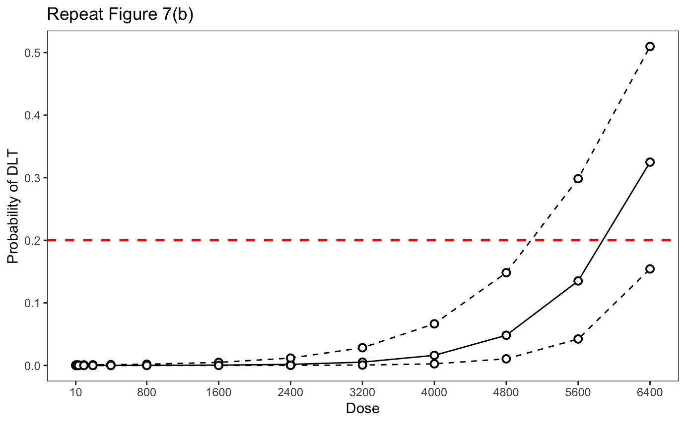
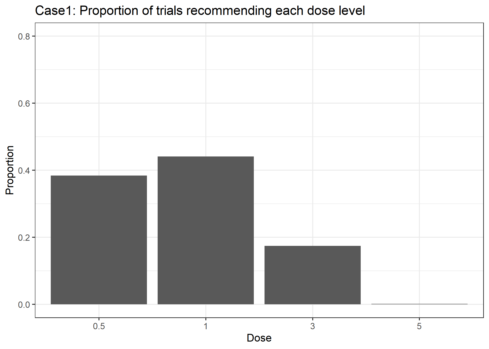
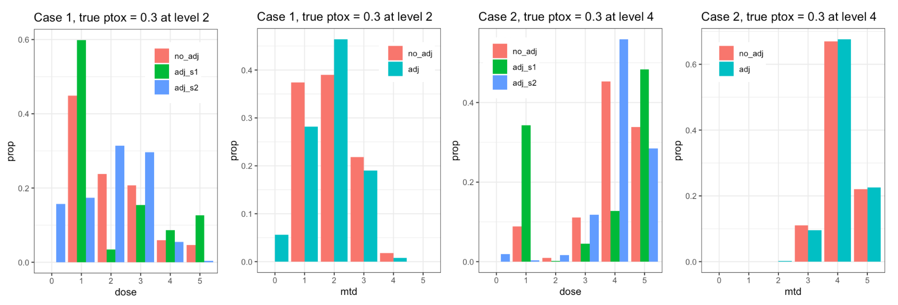

# 1. Introduction (by Hongzhang Xie)

Phase I dose-finding clinical trials are conducted to analyze the safety and tolerability of a new drug. This is a critical step in drug development as it marks the first time the new drug is used in humans. The trials aim to determine the Maximum Tolerated Dose (MTD) and give a foundation for further drug development and clinical trials.

Because we are not fully understood the actions and side effects of new drugs in the human body, there is a potential risk to the trial participants. Also, experimenting with new drugs at low doses level may delay patients' chances of treatment. On the other hand, Phase I trials typically require close health monitoring of participants, which requires substantial medical resources and specialized personnel. Therefore, considering ethical and cost factors, phase I dose-finding trials often have a small sample size, with each dose-level cohort comprising only around three participants.

## 1.1 Why frequency is not suitable for phase I dose-finding trials?

The traditional frequency method presumes a fixed coefficient for the Dose Limiting Toxicity (DLT) distribution under the same dose level. Each sample point is an independent draw. Given a large enough sample size, the sampling mean will finally equal the actual coefficient. Hence, we can make a hypothesis test for finding the MTD (such as the assumption that DLT at a particular dose level smaller than 0.33). If we observe enough extreme data based on the null hypothesis, we can reject this hypothesis. However, as the frequency hypothesis test is based on the law of large numbers, there will be a huge variance in phase I dose-finding trials because of the small sample size. In such cases, the likelihood of a type II error (accepting an incorrect null hypothesis) would be very high. The results of the hypothesis test are not robust.

On the other hand, in the process of drug research and development, we often have some prior information about the drug (such as the results of animal experiments). This information is of great help in determining the MTD. However, the frequency method cannot make good use of this information.

Finally, the conclusion of the hypothesis test only rejected or failed to reject. Even if we reject the null hypothesis (e.g. H0: DLT < TTL), the hypothesis test still says nothing to the H1. In other words, rejecting the null hypothesis (H0) just means that the probability of observing the current data is extremely small when H0 is true. It does not give us any evidence for H1 (e.g. DLT >= TTL). We do not know the degree of confidence for DLT >= TTL. But in phase I dose-finding trials, clinicians need this information to decide the following trial strategy. Therefore, it is not suitable for the frequency method in phase I dose-finding trials.

## 1.2 Traditional 3+3 method

Currently, traditional 3+3 method is the mainstream method for determining MTD in phase I dose-finding trials. By the literature review from Tongtong Jin, more than 90% of phase I dose-finding trials use rule-based designs such as traditional 3+3.

The 3+3 method is intuitive, easy to operate, and provides a clear and repeatable method to confirm the MTD, which can be more easily understood and accepted by clinical researchers, approval agencies, and ethics committees with non-statistical backgrounds. At the same time, the 3+3 method is cautious about increasing the dose level and has been tested by many previous studies, which shows that 3+3 has good safety.

However, a large number of studies have pointed out that the 3+3 method also has some disadvantages.

a. The 3+3 method cannot efficiently utilize all the information in the trials. The decision at each dose level depends only on the information of the three (or six) experimental participants at the current dose level. The 3+3 method does not consider the information outside this dose level.

b. In the process of increasing the dose level, at least three subjects are required for each dose level, and the clinicians should wait for the result in the current dose level to make the decision to increase the dose level. Even if the current results show that the preset measurement increases too slowly, it is hard to adjust the dose level during the experiment according to the new information. This may expose more patients to ineffective low doses level treatment and may also delay the overall trial period. (This also shows that the 3+3 method lacks flexibility).

c. When determining MTD, the percentage of DLT is fixed at 33%. The TTR (Target toxicity rate) cannot be set flexibly.

d. Unable to establish a dose-response curve: The 3+3 method can only find a fixed MTD, but cannot build a model to show the relationship of the toxicity in different dose rate.

## 1.3 CRM method

After each trial in a certain dose level, CRM will update the model based on all the data (posterior) and then use this updated model to predict the toxicity risk of each dose level. Based on these results, the clinicians will decide on the next dose level and continue the trial until meeting the stopping rules. Compared with the traditional 3+3 method, CRM has the following advantages:

a. Compared with 3+3 methods, CRM makes better use of all the data that has been collected during the phase I dose-finding trials. In other words, CRM is not only considered the information in the current dose level (3+3) but also considers the DLT information of all previous doses. So CRM can estimate MTD more accurately.

b. In the process of phase I dose-finding trials, CRM can easily adjust the subsequent test design and dose level according to the existing experimental information. Therefore, CRM can reduce the sample size and time wasted during the low-dose level (or reduce the risk of severe toxic reactions by reducing the dose level in the next trial), thereby reducing the risk of patients' exposure to extremely high or low dose levels (high DLT risk or the risk of delayed treatment).

c. CRM can analyze the complex relationship between dose and toxicity by constructing different Dose-toxicity skeleton models and can adapt to different situations by changing the model's parameters. For example, suppose there are two drugs, the DLT probability of the first drug is linearly related to the dose level. The DLT probability of the second drug is extremely low at low dose levels, and the DLT probability increases rapidly after a certain dose level. In the 3+3 method, the strategies of the two drugs are exactly the same, while in the CRM, we can use the power model for the first drug and the logistic model for the second drug for a better fit of the model.

d. The CRM method uses the Bayesian method to construct a dose-response curve, which can better reflect the relationship between toxicity and dose, and can be used to estimate the MTD at any TTR level.

## 1.4 Why is our final project important?

Although the continuous reassessment approach (CRM) has many advantages, it also has some potential disadvantages and limitations:

a. CRM is a relatively complicated method, and there is no mature SOP (standard operating procedure). This means that the experiment needs a statistical expert for inference and decision-making, and the model may be too complex for the clinical team and the SMC (Safety Monitoring Committee or Data and Safety Monitoring Board) member. This has become one of the main barriers to the uptake of CRM methods in phase I dose-finding trials.

b. The dose level in the CRM method increases rapidly under some models (especially single-parameter models), which may increase the risk of the number and severity of DLT while improving the efficiency of the experiment. For this reason, some ad-hoc rules may be needed to control the risk of overdose.

c. The implementation of CRM requires the clinical team to choose appropriate models and parameters. Improper selection or setting may affect the results of CRM. Especially in the early stages of the trial, due to the lack of data, the results of CRM may have large fluctuations in the different prior models.

It should be noted that the development of a drug often has a large amount of research investment and potential marketing profits. Due to the high flexibility of CRM, the clinical team may modify the model base on their personal profits but not based on statistics and medical theory, even though this may put patients at a higher risk of DLT. Therefore, we need to further analyze the effect of models and parameters setting on CRM inference and then establish a complete SOP and avoid the problem of that events.

In our final project, we first conducted a literature review on Wheeler et al. l (2019) and twenty relevant studies. Subsequently, we use the R-studio to make simulations to find the difference between two scenarios with different true toxicity probabilities ((0.25, 0.3, 0.5, 0.6, 0.7) vs (0.01, 0.05, 0.2, 0.3, 0.5)) on the estimated MTD in the CRM model. Finally, we discussed why this difference happens and how to avoid this problem.

We believe that our final project research can help us better understand the impact of toxicity probabilities difference on the MTD results in the CRM model. This finding can help the clinical team estimate MTD more accurately and helps in making the mature SOP of CRM in phase I dose-finding trials.

\newpage

# 2. Literature Review

## 2.1 CRM design for phase 1 dose-finding trials (By William)

CRM is an alternative to the standard 3+3 design based on using a model like a one parameter or two parameter logistic model, to understand the maximum tolerated dose in a phase 1 trial. CRM is more accurate in choosing the MTD, is less likely to choose ineffective doses, treats fewer patients at overly toxic doses, and treats fewer patients at very low doses.[@garrett2006continual] Our paper plans to look at a two-parameter model. A two-parameter model is likely to better estimate the shape of the entire dose-toxicity relationship, [@chevret1993continual] but less efficiently identify the MTD; it may take longer to reach the MTD since two parameters must be estimated, and there may be difficulties fitting the model or obtaining consistent estimates of model parameters. [@iasonos2016dimension]  

The idea behind the CRM starts with a priori dose toxicity curve and a chosen target toxicity rate. This curve will be refit after every cohort (1-3 patients) toxicity outcome, is observed. At every new dose or same dose, the all-prior data is used to update the model/curve (Garrett-Mayer E).  As required a discussion needs to take place with all relevant stakeholders. The target toxicity level is typically set between 20 to 25% and can be as high as 40%. [@brock2017implementing;@moller1995extension] In a review of 197 phase I trials published between 1997 and 2008, the median number of dose levels explored was five (range 2–12). [@penel2012does] 

Inference or decisions can be made using a likelihood or Bayesian methods using the accruing trial data and clinical judgment. In a Bayesian method data from patients in the trial is used to update prior on the model distribution which then gives a posterior distribution for the model parameters and therefore posterior beliefs for the probability of DLT at each dose. These posterior probabilities are used to make dose escalation decisions. By assessing a design’s operating characteristics with a specific prior in a variety of scenarios, the prior distribution can be recalibrated until the model makes recommendations for dose escalations and the MTD that the trial team are happy with [@wheeler2019design].  

Possible decision rules include choosing the dose with an estimated probability of DLT closest to the TTL or, more conservatively, choosing the dose with an estimated probability of DLT closest to, but not greater than, the TTL. The first option allows quicker escalation towards the true MTD but may expose more patients to overdoses. The second option reduces the chance of overdosing patients, but may take longer to escalate towards the true MTD [@wheeler2019design]

Samples sizes are determined by the study and how and where its being conducted. Specifying a lower bound based on Cheung’s work and practical upper bound in trial protocols. @kuen2013sample proposed formulae that use a target average percentage of correctly selecting the MTD (say, 50% of the time) to obtain a lower bound for the trial sample size (Wheeler,M Graham).  Although CRM designs, like standard ones, can halt after only 10–14 subjects, it is typically necessary to plan for at least 18–24 total subjects, after which the probability of a correct MTD choice rises slowly with sample size [@garrett2006continual]

Cohort size at each dose level typically is more than 1. A cohort size of one allows better understanding of operating characteristics but this is rarely used. [@garrett2006continual] There could be regulatory constraints. If cohort size is greater than 2, then a monitoring plan is needed.

Stopping rules for the trial include the following examples. Early termination can be considered if the MTD is judged to be outside the planned set of doses. Adding additional patients is unlikely to yield information that would change the current MTD estimate. Fixed no of patients has been consecutively dosed at one dose level. Estimated probability of all dose levels having a DLT rate about the TTL is at least 90%. The probability that the next m patients to be dose in the trial will be given the same dose levels, regardless of DLT outcomes observed, exceed some level [@wheeler2019design]. 


## 2.2 Summary for references 
### 2.2.1 References 1-5 (by Tongtong Jin)

#### Phase 1 trial and maximum tolerated dose (MTD)

The phase 1 trials in oncology are usually designed to obtain the optimal dose of a new treatment for efficacy testing in subsequent phase 2 trials. For cytotoxic agents, the probability of treatment benefit is presumed to be positively proportional to the dose in a certain range of consideration. Thus, the optimal dose in phase 1 trial is usually considered as the highest dose at a tolerable level of toxicity. And the optimal dose we are seeking for is exactly the maximum tolerated dose (MTD).

To define MTD in a more rigorous way, it is the dose expected to produce some degree of medically unacceptable, dose limiting toxicity (DLT) in a specified proportion $\theta$ of patients. Namely,

$$Prob(DLT | Dose = MTD) = \theta,$$ where the proportion $\theta$ is also defined as the target toxicity level (TTL) [@babb2004bayesian;@cater1972study].

#### Dose escalation methods in phase 1 trials

To find the MTD we defined above, in clinical testing we adopt dose escalation methods, which is based on the prior belief that the toxicity increases monotonically with increasing dose. The principle of dose escalation in phase 1 trials is both maintaining the toxicity at a safe level and the information accumulation at a rapid speed and at the same time avoid patients being exposed to subtherapeutic doses as much as possible.

Dose escalation methods can be mainly classified in two branches, rule-based designs such as traditional 3+3 design and model-based designs such as continual reassessment method. Rule-based designs don't make any assumptions for the function of toxicity with respect to dose level. And the next step of dose is purely dependent on the information from the last dose. Then finally terminates at some certain stopping criteria. But model-based designs assume there's a specific function between dose and toxicity, usually power functions, logistic functions etc., and then apply accumulated information from every dose to determine the next dose.

From the perspective of practical use, rule-based designs like traditional 3+3 are easier to implement, but model-based designs need biostatistical expertise and available software on site to perform real-time model fitting. As for the information utilization, rule-based designs only use current information, but model-based designs make use of all toxicity information accumulated during the trial, which can be more comprehensive. In the aspect of the exposure to subtherapeutic doses, model-based designs relatively treat fewer patients at suboptimal doses than rule-based ones. Hence according to the principle of dose escalation methods, the model-based designs usually do better in rapid information accumulation and reducing excessive exposure to subtherapeutic doses.[@le2009dose].

#### Current popularity of rule-based designs and model-based designs in phase 1 trials

Although the model-based designs show great advantages in many aspects, rule-based designs like the 3+3 design are still more prevailingly used, and model-based designs are rarely used. Some statistical results about the popularity of these two types of methods in phase 1 trials are as follows.

@rogatko2007translation examined through the records of cancer phase 1 trial from the Science Citation Index database from 1991 to 2006 and divided them into two sets (dose-finding trials and methodologic studies of dose-escalation designs). Then track among these two sets which trials adopted new statistical designs. As a result, only 1.6% trials follow one of the methodologic studies and show extensive lags on publication time. The rest of the trials all follow the traditional up-and-down method (a type of rule-based method).

@chiuzan2017dose studied the degree of adoption of the methods with new trial designs on early phase trials of molecularly targeted agents (MTA) and immunotherapies. It searched papers published from 2008 to 2014 about phase 1 oncology trials and found that in dose-finding trials, 92.9% of them utilized rule-based designs and 5.4% used model-based designs or other novel designs. Particularly, among the MTA and immunotherapies trials, 5.8% used model-based designs. The results show that the adoption of model-based designs and novel designs remains low.

Above phenomenon could be caused by limited time and effort of clinicians and statisticians and the lack of comprehensive and detailed tutorials and instructions for the newly designed approaches.[@rogatko2007translation;@chiuzan2017dose].


### 2.2.2 References 6-10 (by Yiwei Ding)

#### Reference 6: 
@o2006experimental

For the atistical design of dose-finding studies, the standard design is a ‘memoryless’ design and it's not so satisfying. This paper describes designs with memory and we discuss how these designs are superior to memoryless designs. The most well-known design with memory is the continual reassessment method (CRM).

#### Reference 7: 
@harrington2013adaptive

Carrying out dual-agent phase I trials for medications is crucial. There are predominantly two kinds of dose-escalation trials: rule-based and model-based. Trials based on models are progressively adjusted with the help of Bayesian techniques, which merge preliminary data concerning the dose-toxicity relationship. Studies using simulations indicate that model-driven designs tend to treat a greater proportion of patients at near-optimal dose levels.

#### Reference 8:
@AdaptiveDesignsWorkingGroup2017

This paper summarize why modelbased designs such as the continual reassessment method (CRM) are more available than 3+3 and similar rulebased A+B designs. Compared with rule-based designs, Modelbased designs can clearly define and can flexibly choose target DLT rate; many patients can be treated at the optimal dose; few patients can be treated at subtherapeutic doses; the utilization of available data is efficient; extension to more complex questions is smooth & straightforward; deviations from the plan are easily accommodated.


#### Reference 9: 
@jaki2013principles

There are three classes of dose-escalation trial design: gorithmic approaches (including the popular 3+3 design), Bayesian model-based designs and Bayesian curve-free methods. The main benefit of algorithmic approaches is the simplicity. Model-based and curve-free Bayesian approaches are more preferable because they are more able to identify the dose with the desired toxicity rate and allocate a greater proportion of patient. For statistical and practical reasons, Bayesian model-based or curve-free approach is better. If there is sufficient evidence of high enough quality from previous studies, the model-based approach will be better, otherwise curve-free one is better.

#### Reference 10: 

@o1990continual

For the design and analysis of Phase I clinical trails in cancer, attention focuses rather on identifying a dose with a given targeted level is the best estimate of this level. Such sequential designs is called continual reassessment method (CRM). In the procedure, we update our notion of the dose-reponse relationship. From the simulations, this method is good.


### 2.2.3 References 11-15 (by Ujjwal Sehrawat)

Clinicians are interested in phase 1 dose finding designs that can estimate the MTD using fewer patients with a fixed number of doses, or can test more dose levels for a given sample size. Several studies have compared CRM to the traditional SM (3+3 standard method that escalates doses after 3 patients with an option for an additional 3 patients; also called traditional method TM or the “up-and-down scheme) [D*] and found that CRM is more likely to recommend the correct MTD and dose more trial patients close to the MTD. [@o1999another;@thall2003practical;@iasonos2008comprehensive; @onar2009continual;@onar2010simulation] We expound on some of these prior works below.


@o1999another in response to @korn1994comparison’s  findings about CRM’s slower time duration and poorer safety standards relative to SM concluded that, indeed, CRM does not take longer than SM when the comparison fairly accounts for comparable grouping inclusions and that CRM is, indeed, safer for a randomly chosen patient than SM as per simulation results that show that the probability of being treated at very high toxic levels is almost always higher with SM than CRM. Furthermore, O’Quigley et al. argued that if treating patients at unacceptably low sub-therapeutic levels is considered part of the safety definition, then CRM also performs much better than SM. Unlike SM, it is entirely straightforward to adjust CRM to make it safe as we require. All it requires is to change the target level, say from 0.2 to 0.1. In this case, the observed number of toxicities will be, on average, roughly halved. One of the main advantages of CRM, O’Quigley et al. argued, is its flexibility and ability to be adapted to potentially different situations unlike SM which is rigid, samples independently of any targeted percentile, and has no convergence properties. [@o1999another]


@thall2003practical described and compared 2 practical outcome-adaptive statistical methods for dose finding in phase 1 clinical trials: CRM and a logistic regression model-based method. Both methods used Bayesian probability models as a basis for learning from the accruing data during the trial, choosing doses for successive patient cohorts, and selecting an MTD. These methods were illustrated and compared to the SM by application to a particular trial in renal cell carcinoma. The paper compared average behavior by computer simulation under each of several hypothetical dose-toxicity curves. The comparisons showed that the Bayesian methods are much more reliable than the conventional algorithms for selecting an MTD, and that they have a low risk of treating patients at unacceptably toxic doses. [@thall2003practical]


@iasonos2008comprehensive compared several CRM-based methods with SM. For comparison, variations were given to the number of dose levels (5 to 8) and the location of the true MTD. Only CRM with constraint in dose escalation was evaluated since it is more likely to be used by clinicians as the O’Quigley et al.’s original CRM [@o1990continual] allows skipping dose levels in the absence of DLT’s, potentially unnecessarily exposing patients to highly toxic drug levels which makes clinicians uncomfortable. Furthermore, 3 CRM-based methods that combine rule-based and model-based approaches were evaluated. They found that CRM and SM are comparable in terms of how fast they reach the MTD as well as the total sample size needed when testing a limited number of dose levels ($\leq$ 5), however, as the number of dose levels was increased, CRM reached the MTD in fewer patients when used with a fixed sample of 20 patients. However, a sample size of 20—25 patients is not sufficient to achieve a narrow precision around the estimated toxicity rate at the MTD. CRM with a fixed-sample performed better than a CRM with stopping rule that ensures a narrow confidence interval around the toxicity rate at the MTD. CRM-based methods were found to be better than SM in terms of accuracy and optimal dose allocation in almost all cases except when the true dose was among the lower levels. [@iasonos2008comprehensive]

Onar et al. in their paper [@onar2009continual] provided modifications to CRM largely motivated by specific challenges encountered in the context of the Pediatric Brain Tumor Consortium trials and compared them to SM. While some versions of CRM assume availability of doses in a continuous way given a range, this paper used preset levels as it is more acceptable to clinicians and easier to manage operationally especially in multi-institutional settings. Patients in these pediatric trials were dosed by body surface area (BSA) instead of in terms of “mg” as done in adult trials. A frequentist likelihood-based approach with a 2-parameter logistic model [@piantadosi1998practical] was used as follows: Phu(x_j, a) = exp(alpha + beta* x_j) / (1 + exp(alpha + beta* x_j}). Also, “prior information” was used to fit the model which is needed especially during early trial stages. Compared to SM, simulations indicated that their modified CRM was more accurate, exposed fewer patients to potentially toxic doses and tended to require fewer patients. They also argued that as the CRM-based MTD has a consistent definition across trials, it is convenient especially in consortium settings where multiple agents are being tested in studies often running simultaneously and accruing from the same patient population.   [@onar2009continual]

Onar-Thomas et al. [@onar2010simulation] compared the performance of CRM vs SM vs the Rolling-6 design via simulations. The Rolling-6 design is a relative newcomer developed with the intention to shorten trial duration by minimizing the period of time during which the trial is closed to accrual for toxicity assessment. Results indicated that the toxicity rates were comparable across the 3 designs, but the SM and the Rolling 6 designs tended to treat a higher % of patients at doses below the MTD. In cases where 5,6 or more dose levels were proposed to be studied and some toxicities were expected, model-based designs (CRM) had distinct advantages in being able to use the data from all dose levels in estimating the MTD, in accommodating patient-specific dosing and in providing an MTD estimate that is associated with a toxicity probability. Doses identified as MTD by the SM and the Rolling-6 differed in a large % of trials. Results also showed that body surface area (BSA)-based dosing used in pediatric trials can make a difference in dose escalation/de-escalation patterns in CRM relative to cases where such variations are not taken into account in the calculations (such as most adult trials) also leading to different MTDs in some cases. Rolling-6 was found to have shorter trials relative to SM. CRM lead to shorter trial duration for slow to medium accrual rates whereas Rolling-6 may have an advantage if the accrual rate is fast. Rolling-6 may be preferable over the CRM if very few or no toxicity is expected with the agent under study and if the dose finding period is long.  [@onar2010simulation]


#### 2.2.4 References 16-20 (by William)
#### Reference 16: 

@le2012efficiency

This paper provide evidence that more extensive implementation of innovative dose escalation designs such as mCRM and ATD in phase I cancer clinical trials of molecularly targeted agents. This paper did a literature review based on 84 trials that reached MTD. The goal was to get more insight on the efficiency of new dose escalation methods in phase I trials of molecularly targeted agents. The literature review indicated a standard 3+3 design was used in 41 trials (49%) while newer algorithm based methods were also used, including ATD in 35 trials (42%) and CRM (mCRM), which was employed in only 6 trials (7%).
The mean MTD to starting dose ratio appeared to be at least twice as high for trials using a mCRM or an ATD as for trials using a standard ‘‘3+3’’ design. The mean number of patients exposed to a dose below the MTD for all three trial designs was similar, ranging from 19 to 23. the mean number of patients exposed to doses exceeding the MTD was at least twice as high in trials using a standard ‘‘3+3’’ design or an ATD when compared to trials using a mCRM


#### Reference 17:

@garrett2006continual

The paper 'The continual reassessment method for dose-finding studies: a tutorial' provides detailed explanation how to implement a CRM. Does simulation with varying parameters to show how the CRM is better than the 3+3

#### Reference 18 (Preview version):

@cheung2011dose

The book 'Handbook of Methods for Designing, Monitoring, and Analyzing Dose-Finding Trials' discusses Phase I designs, methodology for Phase I/II. In addition various types of Phase II dose Finding trials are discussed. This book is trying to understand the high failure rate in Phase II clinical trials by improving the poor accuracy in early-phase trials. Book reviews the classical 3+3 design and model based designs. The book discusses barriers to adopting newer designs, available software and tools, current usage of different designs in clinical practice, modification of design rules related to start-up, stopping and choice of endpoints. Model based designed discussed include the CRM and escalation with overdose control

#### Reference 19 (Preview version):
@o2017handbook

The book 'Dose Finding by the Continual Reassessment Method' focusses on CRM approach for studies designed with binary outcome and subjects come from a homogenous population. This book is a 'how-to' book to implement CRM and includes what to do and what not to do. Book includes details on how to calibrate CRM parameters based on general patterns. The book also discusses the theoretical and methodological viewpoint including pathological behaviors of CRM modification in simpler settings. The goal of the book is finding dose criteria using a CRM design based on current literature and the CRM trials the author helped implement.

#### Reference 20: 
@food2013adaptive

FDA guidance indicates Bayesian methods can be used in clinical trial for Drugs and Biologics. This guidance indicates that Bayesian inference is characterized by drawing conclusions based directly on posterior probabilities that a drug is effective and has important differences from frequentist inference (Berger and Wolpert 1988). For trials that use Bayesian inference with informative prior distributions, such as trials that explicitly borrow external information, Bayesian statistical properties are more informative than Type I error probability.


\newpage

# 3. Methodology
## 3.1 Describe the use of the logistic regression model in our study (By Tongtong Jin)

The model we use here to predict the relation between dose level and the probability of DLT is the two-parameter logistic regression model which has the form as follows: $$p_j=p(d_j|\beta_1,\beta_2)=\frac{exp(\beta_1+exp(\beta_2)d_j)}{1+exp(\beta_1+exp(\beta_2)d_j)}.$$ And in Bayesian setting, this is the likelihood function for dose level j given $\beta_1$ and $\beta_2$.

### 3.1.1 Bayesian CRM

In the Bayesian setting of CRM, we first need to choose the prior distributions of parameters $\beta_1$ and $\beta_2$. Let's denote the prior by $f(\beta_1,\beta_2)$. Then the posterior distribution given the data of k dose levels $D_k$ is as follows: $$L(D_k|\beta_1,\beta_2)=\prod_{j=1}^{k}p_j^{y_j}(1-p_j)^{n_j-y_j} ,$$ where $n_j$ is the number of tested patients at the j-th dose level, and $y_j$ is the number of patients showing DLT at the j-th dose level. Then we can get to the posterior distribution given $D_k$ by applying above in the Bayes' rule. The posterior is $$p_k(\beta_1,\beta_2|D_k)=\frac{L(D_k|\beta_1,\beta_2)f(\beta_1,\beta_2)}{\iint L(D_k|\beta_1,\beta_2)f(\beta_1,\beta_2)d \beta_1 d \beta_2}.$$

Then the posterior mean of DLT probability at each dose level is $$\mathbf{E}[p_j|D_k]=\iint p_j p_k(\beta_1,\beta_2|D_k)d \beta_1 d \beta_2$$

To look for an appropriate dose level for the next trial, our principle is to find the dose level with the DLT probability closest to TTL. Hence the next dose level can be defined as $$d_{next}=\arg\min_{d_j\in S}(|TTL-\mathbf{E}[p_j|D_k]|).$$ Here S is the set of all permissible choices of dose level.[@babb2004bayesian]

### 3.1.2 Two-stage likelihood-based CRM

Two-stage likelihood CRM divides the process into two stages. In the first stage, the patients are dosed in single-patient cohorts until the first DLT appears. After the first appearance of DLT, the CRM starts to work on the data based on all the previous trials (first-stage data included).

The stage 2 procedure is similar to the above, but using a maximum likelihood estimation (MLE) to estimate the parameters $\beta_1$ and $\beta_2$ and calculate the corresponding probability of DLT at each dose level. The estimated parameters based on given data on k dose levels are $$(\hat{\beta_1},\hat{\beta_2})=\arg\max_{(\beta_1,\beta_2)} L(D_k|\beta_1,\beta_2).$$ Here $L(D_k|\beta_1,\beta_2)$ is the same as defined above in the Bayesian setting. Then we can compute the probability to DLT at each dose level under the current MLE of the parameters $p(d_j|\hat{\beta_1},\hat{\beta_2})$. Now since we want the next dose level to have the closest probability of DLT to TTL, we're able to define the next dose level by $$d_{next}=\arg\min_{d_j\in S}(|TTL-p(d_j|\hat{\beta_1},\hat{\beta_2})|).$$ Iterate above procedure until the dose level meets the stopping condition. Then the second stage terminates.[@wages2013performance]

## 3.2 (By Ujjwal Sehrawat)
- Note: content?

## 3.3 Implementation plan (By Yiwei Ding)

Here we reproduce results in specific figures by fitting a logistic regression model. We run simulations using the CRM with logistic regression, and we derive Figure 6&7. Figure 6 used a one-stage Bayesian approach and Figure 7 used a two-stage likelihood-based approach.

To reproduce Fig. 6, we should use a one-parameter logistic model and placed an exponential prior distribution with a mean of 1. Throughout the trial, calculations were made for the posterior estimates of the likelihood of dose-limiting toxicity (DLT) at each dosage. The upcoming group was then administered the dosage that had an estimated DLT probability most closely aligning with the target toxicity level (TTL).

To reproduce Fig. 7, instead we implemente a two-stage likelihood-based CRM design. We combined a one-parameter power model for the dose-toxicity relationship. During the initial stage, virtual patients were given gradually increasing doses, starting with a dose of 10 ng/kg, which was 1% of the Maximum Tolerable Dose (MTD) in dogs. If a grade 2+ non-DLT adverse event occurred in a patient, two more virtual patients received the same dosage. If none of the trio exhibited a Dose-Limiting Toxicity (DLT), the study continued escalating the dosage in the first stage. Once the first DLT was observed, the second stage, based on the model, was initiated.

A dose skeleton, which was determined after the first DLT (as it wasn't needed during the first phase), was used to establish dose labels for each dose. The likelihood of a DLT at each dose was determined using maximum likelihood methods, and the upcoming patient was assigned the dose that had an estimated DLT likelihood closest to the Target Toxicity Level (TTL). This was under the condition that no dose level that hadn't been tested could be bypassed. Single-patient cohorts were the norm because a low toxicity incidence was anticipated, and each virtual patient was thoroughly observed before the next patient was assigned a dose.


# Model Reproduction (By Zikai & Bowei)

-   Reproduce results in Figures 6 & 7

```{r echo=TRUE}
# R code for model reproduction goes here
```

The model in the paper uses a one parameter logistic model:

$$
\frac{exp(3+exp(\beta_1)d_j)}{1+exp(3+exp(\beta_1)d_j)}
$$

The prior on $\beta_1$ is an exponential distribution with mean 1. They chose (0.05, 0.10, 0.15, 0.33, 0.50) as their skeleton. In the trial, the dose escalation is based on point estimates of the posterior probability of a dose-limiting toxicity (DLT) at each dose level. According to this rule, the next cohort is treated at the dose with the closest mean or median posterior probability of DLT to the specified target probability, 33% in our case. We reproduce figures 6 below. 


## Figure 7 (By Bowei Kang)

```{r}
library(dfcrm)
dose = c(10, 20, 40, 100, 200, 400, seq(800, 6400, by = 800))
y = rep(0, 37); y[c(26, 35, 37)] = 1
level = c(1:11, rep(10,3), rep(11,4), rep(12,8), rep(13,6), rep(14,5))
# use standard logistic regression prediction as prior p(DTL)
data = data.frame(x=dose[level], y)
logit = glm(y ~ x, family = "binomial")
x_pred = with(data, data.frame(x = dose))
tbl = cbind(x_pred, predict(logit, newdata = x_pred, type = "response", se = F))
p.tox0 = tbl[,2]
target = 0.2
foo <- crm(p.tox0, target, y, level, model = 'logistic')
ptox <- foo$ptox  # updated estimates of toxicity rates
```

```{r}
library(ggplot2)
tbl = data.frame(x=dose, p=foo$ptox, lb=foo$ptoxL, ub=foo$ptoxU)
ggplot(tbl) + 
geom_line(aes(x, p)) + geom_point(aes(x, p), shape = 21, colour = "black", fill = "white", size = 2, stroke = 1) + 
geom_line(aes(x, ub), linetype = 2) + geom_point(aes(x, ub), shape = 21, colour = "black", fill = "white", size = 2, stroke = 1) +
geom_line(aes(x, lb), linetype = 2) + geom_point(aes(x, lb), shape = 21, colour = "black", fill = "white", size = 2, stroke = 1) +
geom_hline(yintercept = 0.2, col = 'red', linetype = 2, linewidth = 0.8) + 
theme_bw() + theme(panel.grid.major = element_blank(), panel.grid.minor = element_blank()) +
scale_x_continuous(breaks = dose[-(2:6)]) + labs(title = 'Repeat Figure 7(b)', x = 'Dose', y = 'Probability of DLT')
```



# Simulation Studies (By Wenqian & Gabe)

To rigorously assess the effect of varying true toxicity probabilities on the estimated MTD within the CRM model, we conducted simulation studies under two distinct scenarios, each comprising 1000 trials.
In the first scenario, the true toxicity probabilities were set at 0.25, 0.3, 0.5, 0.6, and 0.7, while in the second, they were defined as 0.01, 0.05, 0.2, 0.3, and 0.5. This design facilitated a comprehensive comparative analysis of the impact of different toxicity probabilities on the estimated MTD.
Each trial was conducted with a sample size of 36, a cohort size of 3, and an initial dose level of 0.5 mg. The target toxicity rate was set at 0.33. The MTD was identified as the dose level where the estimated toxicity probability was closest to the target toxicity rate, ensuring a statistically robust and clinically relevant selection.


Contrary to the original experiment, the simulation uses a two-parameter logistic function to model the relationship between dose and toxicity. The two-parameter logistic function is defined as follows:
$$
\frac{exp(\beta_1+exp(\beta_2)d_j)}{1+exp(\beta_1+exp(\beta_2)d_j)}
$$
where $\beta_1$ and $\beta_2$ are the parameters to be estimated. The dose label $d_j$ is defined as follows:
$$
d_j=\frac{\ln(\frac{p_j}{1-p_j})-\beta_1}{\beta_2}
$$
where $p_j$ is the prior toxicity probability at dose level $j$ (the skeleton).

The prior distribution of $\beta_1$ and $\beta_2$ are set to be bivariate normal distributions. The prior mean of $\beta_1$ is assumed to be 0 and the prior mean of $\beta_2$ is assumed to be 1. 
The prior standard deviation of $\beta_1$ and $\beta_2$ are both assumed to be 1. The prior correlation between $\beta_1$ and $\beta_2$ is assumed to be 0. The prior predictive distribituin based on the prior mean of $\beta_1$ and $\beta_2$ is shown in the following figure.


In the context of the first scenario, a comprehensive analysis of the 1000 trials revealed that 47.3% accurately identified 1 mg as the Maximum Tolerated Dose (MTD), which aligns with the true MTD as determined by the pre-set toxicity probabilities. Furthermore, it was observed that 37.8% of the simulated "patients" received treatment at this dose level.

In contrast, under the parameters of the second scenario, a significantly higher proportion of trials, 69.2% to be precise, correctly selected 5 mg as the MTD. Additionally, 48.1% of the "patients" within these simulations were treated at this dose level.

### Proportion of trials selecting each dose level as the MTD
| Dose level (mg/m^2/day) | 0.5 | 1 | 3 | 5 | 6 |
|----------|----------|----------|----------|----------|----------|
| Scenario 1    | 0.241 | 0.473 | 0.275 | 0.011 | 0 |
| Scenario 2    | 0| 0| 0.069 | 0.692 | 0.239 |

### Proportion of patients treated at each dose level
| Dose level (mg/m^2/day) | 0.5 | 1 | 3 | 5 | 6 |
|----------|----------|----------|----------|----------|----------|
| Scenario 1    | 0.301 | 0.378 | 0.276 | 0.0427 | 0.00183 |
| Scenario 2    | 0.0834 | 0.0863 | 0.152 | 0.481 | 0.197|


The performance difference of the CRM model under the two scenarios is because firstly, the true toxicity probabilities under the first scenario have a smaller discrepancy 
between 0.5 mg (true toxicity of 0.25) and 1 mg (true toxicity of 0.3). Hence, a fair amount of trials under scenario 1 choose 0.5 mg as the MTD. 
second, the true toxicity probabilities under scenario 2 is much closer to the prior assumed toxicity probabilities, i.e. the skeletons. Therefore, it's easier 
for the CRM model to estimate the posterior probabilities under scenario 2.


# Some explorations
## The use of Bayes risk and Bayesian decision theory (Zikai)

The standard dose recommendation rule in the use of the CRM relies on point estimates of the posterior probability of a dose-limiting toxicity (DLT) at each dose level. According to this rule, the next cohort is treated at the dose with the closest mean or median posterior probability of DLT to the specified target probability, 33% in our case. This rule is simple and easy to implement. However, it disregards the uncertainty associated with the point estimates of the posterior probabilities, which can usually be substantial given the small sample sizes. 

An alternative is to use Bayes risk for posterior probability intervals associated with each dose as the inferential summary (Neuenschwander, Branson and Gsponer, 2008). We first define Bayes risk values for each of the following intervals:

\begin{aligned*}
L(\theta, d)= \begin{cases}\ell_1=1 & \text { if } \pi_\theta(d) \in(0,0.31] \\
\ell_2=0 & \text { if } \pi_\theta(d) \in(0.31,0.35] \\
\ell_3=1 & \text { if } \pi_\theta(d) \in(0.35,0.6] \\
\ell_4=2 & \text { if } \pi_\theta(d) \in(0.6,1]\end{cases}
\end{aligned*}

After each cohort of patients has gone through the trial, we estimate the posterior distributions of toxicity for each dose level, $\pi_\theta(d)$. The Bayes risk of each dose level is calculated as follows:
$\ell_1 P\left\{\pi_\theta(d) \in\right.\right. \left.(0,0.31]\}+\ell_2 P\left\{\pi_\theta(d) \in(0.31,0.35]\right\}+\ell_3 P\left\{\pi_\theta(d) \in(0.35,0.6]\right\}+\ell_4 P\left\{\pi_\theta(d) \in(0.6,1]\right\}$

After each 36-patient trial is concluded, data is pooled for calculating the Bayes risk for each dose level. The dose level with the lowest Bayes risk is recommended as the dose level for the next cohort. The trial terminates when all 36 patients get treated and the MTD is determined basded on the overall Bayes risk of each dose level. 

The results of this simulation, however, did not improve the accuracy of the first scenario markedly compared to our baseline approach. 

 


## Conditionally adding extra lower dose level (by Bowei Kang)

The idea is increasing estimate accuracy by expanding the dose range. In a simple linear regression, $Y = \alpha + \beta X + \epsilon$, $Var(\hat{\beta} = \sigma^2 (X′X)^{-1}$. Small sample variation in $X$ leads to the inflation in standard error of the estimate. 

We propose the following design: at the 1/3 cut point of the trail, we evaluate the dose visit frequency. If the distribution is too skewed to the right, that is, most patients are assigned to dose level 1, an extra lower level 0 will be added for the remaining 2/3 patients. Otherwise, we continue the previous standard CRM design.

The proposed design can improve accuracy for scenario 1 and mitigate the discrepancy between the two scenarios. This is demonstrated by the following simulation results.

```{r message=F}
library(bcrm)
library(ggplot2)
library(tidyverse)
```

```{r}
dose = c(0.5, 1, 3, 5, 6)
p.tox0 = c(0.05, 0.10, 0.15, 0.33,0.50) 
p_true_1 = c(0.25, 0.30, 0.50, 0.60, 0.70)
p_true_2 = c(0.01, 0.05, 0.20, 0.30, 0.50)
N = 36
n_per_cohort = 3
ncohort = N/n_per_cohort
target = 0.33
```

### Classical CRM (as comparison)

Functions

```{r}
single_run = function(N, n_per_cohort, target, p_true, p.tox0, dose, plt = F) {
ncohort = N/n_per_cohort
path = data.frame(patient = 1:N, dose = NA, tox = NA, batches = NA)
# Here dose represent dose levels of recruited patients, ranging from 1, ..., k
# generate a path
for (i in 1:ncohort) {
if (i == 1) {
level_current = 1
batch_current = 1
}
path[((i-1)*3+1):(i*3), 'dose']  = level_current
path[((i-1)*3+1):(i*3), 'batches'] = batch_current
path[((i-1)*3+1):(i*3), 'tox'] = rbinom(n_per_cohort, 1, p_true[level_current])
# estimate p.tox profile based on current path
ids_batch_sofar = which(path[, 'batches'] %in% 1:batch_current)
level_update_bcrm = bcrm(stop = list(nmax = length(ids_batch_sofar)), data = path[ids_batch_sofar, ], dose = dose, p.tox0 = p.tox0, ff="logit2", prior.alpha=list(4, c(1, 1), rbind(c(1, 0), c(0, 1))), target.tox = target, constrain = F, pointest = "mean", method = 'rjags')
# pointest: Which summary estimate of the posterior distribution should be used to choose the next dose.
level_update = as.numeric(level_update_bcrm$ndose[[1]]$ndose)
# update current level and batch 
if (level_update != level_current) {
batch_current = batch_current + 1
level_current = level_update
} 
} # end for
# assume normal priors for params. mu = 0, sd = 1 for both. independent
final_est = bcrm(stop = list(nmax = N), data = path, dose = dose, p.tox0 = p.tox0, ff="logit2", prior.alpha = list(4, c(1, 1), rbind(c(1, 0), c(0, 1))), target.tox = target, constrain = F, pointest="mean", method = 'rjags')
ptox = final_est$ndose[[1]]$est
ptoxL = final_est$ndose[[1]]$quantiles[1,]
ptoxU = final_est$ndose[[1]]$quantiles[5,]
mtd = which.min(abs(ptox - target))
if (plt) pp = plt_func(path, ptox, ptoxL, ptoxU, target, mtd, p_true, dose) else pp = NULL
return(list(path = path, ptox = ptox, ptoxL = ptoxL, ptoxU = ptoxU, mtd = mtd, plt = pp))
}
``` 

```{r}
plt_func = function(path, ptox, ptoxL, ptoxU, target, mtd, p_true, dose) {
p1 = ggplot(data.frame(path), aes(patient, dose, col = as.factor(tox))) + geom_point() + theme_bw() + ylim(0, length(dose) + 1) 
tbl = data.frame(x = dose, p = ptox, lb = ptoxL, ub = ptoxU, ptrue = p_true)
p2 = ggplot(tbl) + geom_line(aes(x, p)) + geom_point(aes(x, p), shape = 21, colour = "black", fill = "white", size = 2, stroke = 1) 
p2 = p2 + geom_line(aes(x, ub), linetype = 2) + geom_point(aes(x, ub), shape = 21, colour = "black", fill = "white", size = 2, stroke = 1) + geom_line(aes(x, lb), linetype = 2) + geom_point(aes(x, lb), shape = 21, colour = "black", fill = "white", size = 2, stroke = 1) 
p2 = p2 + geom_line(aes(x, ptrue), col = 'blue') + geom_point(aes(x, ptrue), shape = 22, colour = "blue", fill = "white", size = 2, stroke = 1) 
p2 = p2 + geom_hline(yintercept = target, col = 'red', linetype = 2, linewidth = 0.8) 
p2 = p2 + geom_vline(xintercept = dose[mtd], col = 'green4', linetype = 3, linewidth = 1)
p2 = p2 + scale_x_continuous(breaks = dose) + labs(title = '', x = 'Dose', y = 'Probability of DLT')
p2 = p2 + theme_bw() 
return(ggarrange(p1, p2))
}
```

Multiple runs - scenario 1

```{r}
set.seed(1)
niter = 500
res1 = replicate(niter, single_run(N = 36, n_per_cohort = 3, target = 0.33, p_true = p_true_1, p.tox0 = p.tox0, dose = dose, plt = FALSE))
# visit frequency
print("Percent of patients assigned to each dose over all trials")
vf1 = sapply(res1[1,], function(t) {
summary = NULL
for (i in 1:length(dose)) summary = c(summary, sum(t[, 'dose'] == i))
return(summary)
})
rowSums(vf1) / (niter * N)
# mtd
print("Proportion of simulated trials recommending dose as MTD")
# table(unlist(res1[5,])) / niter
sapply(1:length(dose), function(t) mean(unlist(res1[5,]) == t))
# True ptox
print("True p's")
p_true_1
```

Multiple runs - scenario 2

```{r}
set.seed(1)
niter = 500
res2 = replicate(niter, single_run(N = 36, n_per_cohort = 3, target = 0.33, p_true = p_true_2, p.tox0 = p.tox0, dose = dose, plt = FALSE))
# visit frequency
print("Percent of patients assigned to each dose over all trials")
vf2 = sapply(res2[1,], function(t) {
summary = NULL
for (i in 1:length(dose)) summary = c(summary, sum(t[, 'dose'] == i))
return(summary)
})
rowSums(vf2) / (niter * N)
# mtd
print("Proportion of simulated trials recommending dose as MTD")
# table(unlist(res2[5,])) / niter
sapply(1:length(dose), function(t) mean(unlist(res2[5,]) == t))
# True ptox
print("True p's")
p_true_2
```

### Modified CRM (conditionally adding extra lower dose)

```{r}
dose = c(0.5, 1, 3, 5, 6)
p.tox0 = c(0.05, 0.10, 0.15, 0.33,0.50) 
p_true_1 = c(0.25, 0.30, 0.50, 0.60, 0.70)
p_true_2 = c(0.01, 0.05, 0.20, 0.30, 0.50)
dose_add = c(0.25, dose)
p.tox0_add = c(0.025, p.tox0)
p_true_1_add = c(0.125, p_true_1)
p_true_2_add = c(0.005, p_true_2)
N = 36
n_per_cohort = 3
ncohort = N/n_per_cohort
target = 0.33
train_frac = 1/3
```

Functions

```{r}
single_run_add_dose = function(N, n_per_cohort, target, p_true_add, p.tox0_add, dose_add, train_frac = 2/3, plt = F) {
p_true = p_true_add[-1]
p.tox0 = p.tox0_add[-1]
dose = dose_add[-1]
ncohort = N/n_per_cohort
path = data.frame(patient = 1:N, dose = NA, tox = NA, batches = NA)
# Here dose represent dose levels of recruited patients, ranging from 1, ..., k
# generate the path for the first half
for (i in 1:(ncohort * train_frac)) {
if (i == 1) {
level_current = 1
batch_current = 1
}
path[((i-1)*3+1):(i*3), 'dose']  = level_current
path[((i-1)*3+1):(i*3), 'batches'] = batch_current
path[((i-1)*3+1):(i*3), 'tox'] = rbinom(n_per_cohort, 1, p_true[level_current])
# estimate p.tox profile based on current path
ids_batch_sofar = which(path[, 'batches'] %in% 1:batch_current)
level_update_bcrm = bcrm(stop = list(nmax = length(ids_batch_sofar)), data = path[ids_batch_sofar, ], dose = dose, p.tox0 = p.tox0, ff="logit2", prior.alpha=list(4, c(1, 1), rbind(c(1, 0), c(0, 1))), target.tox = target, constrain = F, pointest = "mean", method = 'rjags')
# pointest: Which summary estimate of the posterior distribution should be used to choose the next dose.
level_update = as.numeric(level_update_bcrm$ndose[[1]]$ndose)
# update current level and batch 
if (level_update != level_current) {
batch_current = batch_current + 1
level_current = level_update
} 
} # end for

# 1/3 way evaluation
# shift one level
path[1:(N*train_frac), 'dose'] = path[1:(N*train_frac), 'dose'] + 1
tt = table(path[1:(N*train_frac), 'dose'])
add_flag = F
# if the largest freq is attained at dose level 1
if (sum(path[1:(N*train_frac), 'dose'] == 2) == max(tt)) {
add_flag = T
level_current = 1
batch_current = batch_current + 1
} 

# second half
for (i in (ncohort*train_frac+1):ncohort) {
path[((i-1)*3+1):(i*3), 'dose']  = level_current
path[((i-1)*3+1):(i*3), 'batches'] = batch_current
path[((i-1)*3+1):(i*3), 'tox'] = rbinom(n_per_cohort, 1, p_true_add[level_current])
# estimate p.tox profile based on current path
ids_batch_sofar = which(path[, 'batches'] %in% 1:batch_current)
level_update_bcrm = bcrm(stop = list(nmax = length(ids_batch_sofar)), data = path[ids_batch_sofar, ], dose = dose_add, p.tox0 = p.tox0_add, ff="logit2", prior.alpha=list(4, c(0, 0), rbind(c(1, 0), c(0, 1))), target.tox = target, constrain = F, pointest = "mean", method = 'rjags')
# pointest: Which summary estimate of the posterior distribution should be used to choose the next dose.
level_update = as.numeric(level_update_bcrm$ndose[[1]]$ndose)
# update current level and batch 
if (level_update != level_current) {
batch_current = batch_current + 1
level_current = level_update
} 
} # end for

# assume normal priors for params. mu = 0, sd = 1 for both. independent
final_est = bcrm(stop = list(nmax = N), data = path, dose = dose_add, p.tox0 = p.tox0_add, ff="logit2", prior.alpha = list(4, c(1, 1), rbind(c(1, 0), c(0, 1))), target.tox = target, constrain = F, pointest="mean", method = 'rjags')

ptox = final_est$ndose[[1]]$est
ptoxL = final_est$ndose[[1]]$quantiles[1,]
ptoxU = final_est$ndose[[1]]$quantiles[5,]
mtd = which.min(abs(ptox - target))
if (plt) pp = plt_func(path, ptox, ptoxL, ptoxU, target, mtd, p_true_add, dose_add) else pp = NULL
return(list(path = path, ptox = ptox, ptoxL = ptoxL, ptoxU = ptoxU, mtd = mtd, flag = add_flag, plt = pp))
}
```

Multiple runs - scenario 1

```{r}
set.seed(1)
niter = 500
res1_add = replicate(niter, single_run_add_dose(N = 36, n_per_cohort = 3, target = 0.33, p_true = p_true_1_add, p.tox0 = p.tox0_add, dose = dose_add, train_frac = 1/3, plt = FALSE))
# visit frequency
print("Percent of patients assigned to each dose over all trials")
vf1_add_half1 = sapply(res1_add[1,], function(t) {
summary = NULL
for (i in 1:length(dose_add)) summary = c(summary, sum(t[1:(N*train_frac), 'dose'] == i))
return(summary)
})
vf1_add_half2 = sapply(res1_add[1,], function(t) {
summary = NULL
for (i in 1:length(dose_add)) summary = c(summary, sum(t[(N*train_frac+1):N, 'dose'] == i))
return(summary)
})
rowSums(vf1_add_half1) / (niter * N * train_frac)
rowSums(vf1_add_half2) / (niter * N * (1-train_frac))
# mtd
print("Proportion of simulated trials recommending dose as MTD")
# table(unlist(res1_add[5,])) / niter
sapply(1:length(dose_add), function(t) mean(unlist(res1_add[5,]) == t))
table(unlist(res1_add[6,])) / niter
# True ptox
print("True p's")
p_true_1_add
```

Multiple runs - scenario 2

```{r}
set.seed(1)
niter = 500
res2_add = replicate(niter, single_run_add_dose(N = 36, n_per_cohort = 3, target = 0.33, p_true = p_true_2_add, p.tox0 = p.tox0_add, dose = dose_add, train_frac = 1/3, plt = FALSE))
# visit frequency
print("Percent of patients assigned to each dose over all trials")
vf2_add_half1 = sapply(res2_add[1,], function(t) {
summary = NULL
for (i in 1:length(dose_add)) summary = c(summary, sum(t[1:(N*train_frac), 'dose'] == i))
return(summary)
})
vf2_add_half2 = sapply(res2_add[1,], function(t) {
summary = NULL
for (i in 1:length(dose_add)) summary = c(summary, sum(t[(N*train_frac+1):N, 'dose'] == i))
return(summary)
})
rowSums(vf2_add_half1) / (niter * N * train_frac)
rowSums(vf2_add_half2) / (niter * N * (1-train_frac))
# mtd
print("Proportion of simulated trials recommending dose as MTD")
# table(unlist(res1_add[5,])) / niter
sapply(1:length(dose_add), function(t) mean(unlist(res2_add[5,]) == t))
table(unlist(res2_add[6,])) / niter
# True ptox
print("True p's")
p_true_2_add
```

For scenario 1 and 2, level 0 was added to 79% and 17% simulated trials after evaluation, respectively.

### Compare classical and modified CRM

Bar chart

Scenario 1, dose visit 

```{r}
prop_no_adj = c(0, 0.44900000, 0.23800000, 0.20750000, 0.05933333, 0.04616667)
prop_adj_s1 = c(0.0000, 0.5985, 0.0345, 0.1545, 0.0860, 0.1265)
prop_adj_s2 = c(0.1570, 0.1740, 0.3145, 0.2960, 0.0550, 0.0035)
doses = rep(0:5, 3)
df_bar = data.frame(dose = as.factor(doses), prop = c(prop_no_adj, prop_adj_s1, prop_adj_s2), case = rep(c('no_adj', 'adj_s1', 'adj_s2'), c(6, 6, 6)))
p1 = df_bar$case = factor(df_bar$case, levels = c('no_adj', 'adj_s1', 'adj_s2'))
ggplot(df_bar, aes(x = dose, y = prop, fill = case)) + geom_bar(stat = "identity", position = position_dodge()) + theme_bw() + theme(aspect.ratio=4/3) + ggtitle('Case 1, true ptox = 0.3 at level 2')
p1
```

Scenario 2, dose visit 

```{r}
prop_no_adj = c(0, 0.08816667, 0.00950000, 0.11066667, 0.45316667, 0.33850000)
prop_adj_s1 = c(0.000000000, 0.342666667, 0.001333333, 0.045333333, 0.127333333, 0.483333333)
prop_adj_s2 = c(0.018666667, 0.003333333, 0.016444444, 0.117777778, 0.558888889, 0.284888889)
doses = rep(0:5, 3)
df_bar = data.frame(dose = as.factor(doses), prop = c(prop_no_adj, prop_adj_s1, prop_adj_s2), case = rep(c('no_adj', 'adj_s1', 'adj_s2'), c(6, 6, 6)))
p2 = df_bar$case = factor(df_bar$case, levels = c('no_adj', 'adj_s1', 'adj_s2'))
ggplot(df_bar, aes(x = dose, y = prop, fill = case)) + geom_bar(stat = "identity", position = position_dodge()) + theme_bw() + theme(aspect.ratio=4/3) + ggtitle('Case 2, true ptox = 0.3 at level 4')
p2
```

Scenario 1, mtd 

```{r}
prop_no_adj = c(0, 0.374, 0.390, 0.218, 0.018, 0.000)
prop_adj = c(0.056, 0.282, 0.464, 0.190, 0.008, 0.000)
mtd = rep(0:5, 2)
df_bar = data.frame(mtd = as.factor(mtd), prop = c(prop_no_adj, prop_adj), case = rep(c('no_adj', 'adj'), c(6, 6)))
df_bar$case = factor(df_bar$case, levels = c('no_adj', 'adj'))
p3 = ggplot(df_bar, aes(x = mtd, y = prop, fill = case)) + geom_bar(stat = "identity", position = position_dodge()) + theme_bw() + theme(aspect.ratio=4/3) + ggtitle('Case 1, true ptox = 0.3 at level 2')
p3
```

Scenario 2, mtd 

```{r}
prop_no_adj = c(0, 0.00, 0.00, 0.11, 0.67, 0.22)
prop_adj = c(0.000, 0.000, 0.002, 0.096, 0.676, 0.226)
mtd = rep(0:5, 2)
df_bar = data.frame(mtd = as.factor(mtd), prop = c(prop_no_adj, prop_adj), case = rep(c('no_adj', 'adj'), c(6, 6)))
p4 = df_bar$case = factor(df_bar$case, levels = c('no_adj', 'adj'))
ggplot(df_bar, aes(x = mtd, y = prop, fill = case)) + geom_bar(stat = "identity", position = position_dodge()) + theme_bw() + theme(aspect.ratio=4/3) + ggtitle('Case 2, true ptox = 0.3 at level 4')
p4
```




# Results and Discussion


# Conclusion

Summary of the report

# Reference

