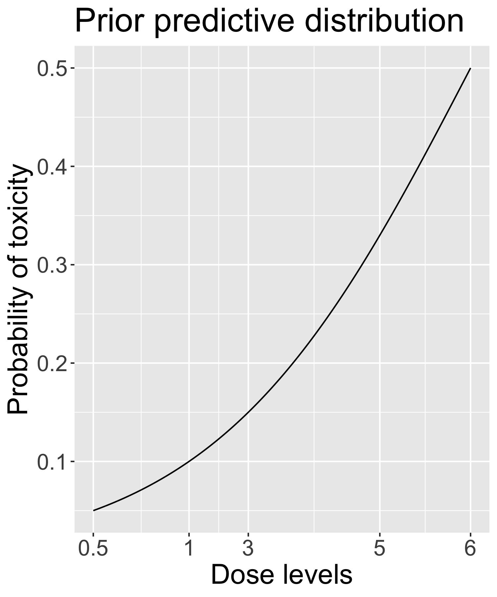

To rigorously assess the effect of varying true toxicity probabilities on the estimated MTD within the CRM model, we conducted simulation studies under two distinct scenarios, each comprising 1000 trials.
In the first scenario, the true toxicity probabilities were set at 0.25, 0.3, 0.5, 0.6, and 0.7, while in the second, they were defined as 0.01, 0.05, 0.2, 0.3, and 0.5. This design facilitated a comprehensive comparative analysis of the impact of different toxicity probabilities on the estimated MTD.
Each trial was conducted with a sample size of 36, a cohort size of 3, and an initial dose level of 0.5 mg. The target toxicity rate was set at 0.33. The MTD was identified as the dose level where the estimated toxicity probability was closest to the target toxicity rate, ensuring a statistically robust and clinically relevant selection.

Contrary to the original experiment, the simulation uses a two-parameter logistic function to model the relationship between dose and toxicity. The two-parameter logistic function is defined as follows:
$$
\frac{exp(\beta_1+exp(\beta_2)d_j)}{1+exp(\beta_1+exp(\beta_2)d_j)}
$$
where $\beta_1$ and $\beta_2$ are the parameters to be estimated. The dose label $d_j$ is defined as follows:
$$
d_j=\frac{\ln(\frac{p_j}{1-p_j})-\beta_1}{\beta_2}
$$
where $p_j$ is the prior toxicity probability at dose level $j$ (the skeleton).

The prior distribution of $\beta_1$ and $\beta_2$ are set to be bivariate normal distributions. The prior mean of $\beta_1$ is assumed to be 0 and the prior mean of $\beta_2$ is assumed to be 1. 
The prior standard deviation of $\beta_1$ and $\beta_2$ are both assumed to be 1. The prior correlation between $\beta_1$ and $\beta_2$ is assumed to be 0. The prior predictive distribituin based on the prior mean of $\beta_1$ and $\beta_2$ is shown in the following figure.

In the context of the first scenario, a comprehensive analysis of the 1000 trials revealed that 47.3% accurately identified 1 mg as the Maximum Tolerated Dose (MTD), which aligns with the true MTD as determined by the pre-set toxicity probabilities. Furthermore, it was observed that 37.8% of the simulated "patients" received treatment at this dose level.

In contrast, under the parameters of the second scenario, a significantly higher proportion of trials, 69.2% to be precise, correctly selected 5 mg as the MTD. Additionally, 48.1% of the "patients" within these simulations were treated at this dose level.

### Proportion of trials selecting each dose level as the MTD
| Dose level (mg/m^2/day) | 0.5 | 1 | 3 | 5 | 6 |
|----------|----------|----------|----------|----------|----------|
| Scenario 1    | 0.241 | 0.473 | 0.275 | 0.011 | 0 |
| Scenario 2    | 0| 0| 0.069 | 0.692 | 0.239 |

### Proportion of patients treated at each dose level
| Dose level (mg/m^2/day) | 0.5 | 1 | 3 | 5 | 6 |
|----------|----------|----------|----------|----------|----------|
| Scenario 1    | 0.301 | 0.378 | 0.276 | 0.0427 | 0.00183 |
| Scenario 2    | 0.0834 | 0.0863 | 0.152 | 0.481 | 0.197 |